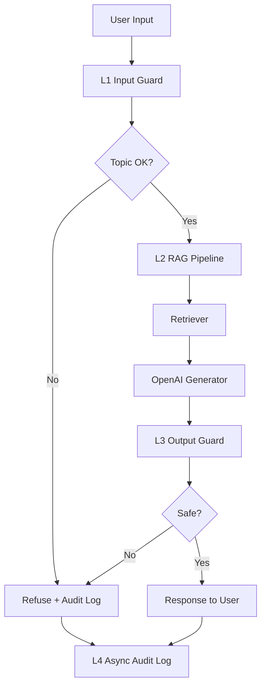

# Blueprint Document: Guarded Legal RAG Platform

## 1. SLO Definition

| Metric | Target | Alert Threshold | Severity |
|---|---:|---:|---|
| `Faithfulness` | `>= 0.85` | `< 0.80` trong `30 min` | `P2` |
| `Answer relevancy` | `>= 0.80` | `< 0.75` trong `30 min` | `P2` |
| `Context precision` | `>= 0.70` | `< 0.65` trong `1h` | `P3` |
| `Context recall` | `>= 0.75` | `< 0.70` trong `1h` | `P3` |
| `P95 latency` vá»›i guardrails | `< 2.5s` | `> 3s` trong `5 min` | `P1` |
| `Guardrail detection rate` | `>= 90%` | `< 85%` trong `1h` | `P2` |
| `False positive rate` | `< 5%` | `> 10%` trong `1h` | `P2` |

## 2. Baseline Metrics

| Hạng mục | Giá trị mới nhất |
|---|---:|
| `faithfulness` | `1.0` |
| `answer_relevancy` | `0.6912` |
| `context_precision` | `0.1897` |
| `context_recall` | `0.784` |
| `pairwise judge rows` | `30` |
| `full stack P95` | `0.52ms` |

## 3. Architecture Diagram

## 4. Alert Playbook

### Incident 1: `Faithfulness` hoặc `Answer relevancy` giảm

**Severity:** `P2`

**Likely causes:** corpus đổi nhưng index chưa rebuild, retriever lấy sai chunk, prompt generator drift.

**Investigation:** kiểm tra `ragas_results.csv`, nhóm theo `evolution_type`, xem 10 câu thấp nhất trong `failure_analysis.md`.

**Resolution:** rebuild index, tăng `top_k`, thêm reranker, hoặc chỉnh prompt generation.

### Incident 2: `P95 latency` vượt `3s`

**Severity:** `P1`

**Likely causes:** OpenAI API chậm, output judge dùng LLM quá nặng, cache index lỗi.

**Resolution:** chuyển guard sang heuristic, giảm `top_k`, bật cache, tách audit log khỏi critical path.

### Incident 3: `False positive rate` vượt `10%`

**Severity:** `P2`

**Likely causes:** topic threshold quá chặt, regex PII over-redaction, output guard nhầm chuỗi an toàn.

**Resolution:** nới threshold, thêm allowlist, review manual các mẫu bị chặn nhầm.

## 5. Cost Analysis

Giả định `100k queries/month`:

| Component | Unit Cost | Volume | Monthly Cost |
|---|---:|---:|---:|
| `RAG generation` (`gpt-4o-mini`) | `$0.01 / query` | `100k` | `$100` |
| `RAGAS-style eval` (`1% sample`) | `$0.01 / query` | `1k` | `$10` |
| `LLM judge` | `$0.01 / query` | `1k` | `$10` |
| `Output guard heuristic` | `$0` | `100k` | `$0` |
| `Optional LLM output guard` | `$0.01 / query` | `10k` | `$100` |
| **Total estimate** |  |  | **`$220`** |

## 6. Conclusion

Blueprint này nối Phase A, B, C thành một quy trình vận hành có `SLO`, alert, playbook và cost estimate. Các số liệu baseline được đọc từ artefact mới nhất sau khi chạy code, nên tài liệu không phụ thuộc vào kết quả mẫu cũ.

