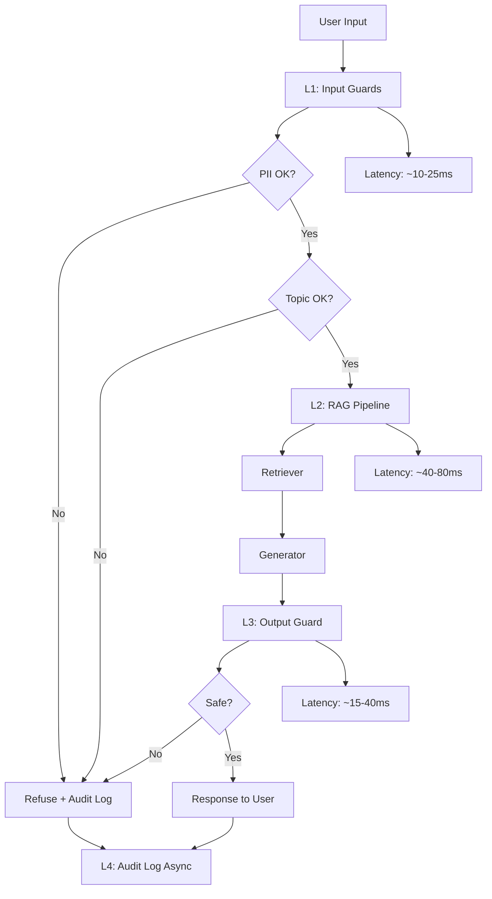

# Blueprint Document: Guarded Legal RAG Platform

## 1. Mục Tiêu Và Phạm Vi

Tài liệu này tổng hợp Phase A, Phase B, và Phase C thành một blueprint có thể dùng làm nền tảng triển khai production cho hệ thống hỏi đáp pháp lý.

Mục tiêu của hệ thống:

- Trả lời câu hỏi về Bộ luật Lao động Việt Nam bằng `RAG`
- Đánh giá chất lượng bằng `RAGAS` và `LLM-as-judge`
- Ngăn `PII`, `off-topic`, `prompt injection`, và output không an toàn bằng `guardrails`
- Giữ độ trễ trong một ngân sách hợp lý để có thể vận hành thực tế

Phạm vi blueprint:

- Corpus chính: `data/luat_lao_dong.md`
- Retriever + generator: Phase A
- Judge + calibration: Phase B
- Guardrails stack: Phase C
- Điều phối vận hành, cảnh báo, và chi phí: Phase D

---

## 2. Baseline Từ Các Phase Trước

### 2.1 Kết quả Phase A

Phase A cho thấy hệ thống `RAG` hiện tại giữ `faithfulness` cao, nhưng vẫn còn khoảng cách chất lượng ở các câu cần parsing điều kiện hoặc kết hợp nhiều điều khoản.

| Metric | Kết quả |
|---|---:|
| `faithfulness` | `1.0` |
| `answer_relevancy` | `0.6912` |
| `context_precision` | `0.1897` |
| `context_recall` | `0.7840` |
| `Simple` count | `25` |
| `Reasoning` count | `12` |
| `Multi-context` count | `13` |

Điều quan trọng hơn là pattern lỗi:

- Nhóm lỗi tệ nhất hiện nghiêng nhiều về `reasoning`
- `multi_context` vẫn là nguồn lỗi ổn định khi câu hỏi buộc phải nối nhiều điều khoản
- Có một số trường hợp `simple` bị kéo xuống do retriever chưa lấy đúng trọng tâm ngữ cảnh
- `failure_analysis.md` hiện xác định `3` cluster:
  - `Lỗi parsing điều kiện / single-hop reasoning`
  - `Retriever bỏ sót ngữ cảnh chính`
  - `Lỗi multi-hop reasoning`

### 2.2 Kết quả Phase B

Phase B cho thấy `judge` dùng được cho calibration nhưng chưa phải ground truth hoàn hảo.

| Metric | Kết quả |
|---|---:|
| Sample size | `10` |
| Human labels | `A = 7`, `B = 2`, `tie = 1` |
| Judge labels | `A = 7`, `B = 2`, `tie = 1` |
| Cohen's kappa | `0.57` |
| Interpretation | `Moderate agreement` |

Kết luận vận hành:

- `swap-and-average` là bắt buộc
- `tie` cần rule chặt hơn
- `position bias` và `length bias` vẫn tồn tại ở mức vừa

### 2.3 Kết quả Phase C

Phase C xác nhận guardrails hoạt động đúng ở mức lab.

| Hạng mục | Kết quả |
|---|---:|
| `PII redaction` | `8/8` |
| `Topic scope validator` | `18/20` |
| `Adversarial blocking` | `18/20` |
| `Output safety` | `19/20` |
| `Full stack P95 latency` | `88.7ms` |

---

## 3. SLO Definition

Hệ thống production cần ít nhất 5 `SLOs` với `alert threshold` rõ ràng.

| Metric | Target | Alert Threshold | Severity |
|---|---:|---:|---|
| `Faithfulness` | `≥ 0.85` | `< 0.80` trong `30 min` | `P2` |
| `Answer relevancy` | `≥ 0.80` | `< 0.75` trong `30 min` | `P2` |
| `Context precision` | `≥ 0.70` | `< 0.65` trong `1h` | `P3` |
| `Context recall` | `≥ 0.75` | `< 0.70` trong `1h` | `P3` |
| `P95 latency` với guardrails | `< 2.5s` | `> 3s` trong `5 min` | `P1` |
| `Guardrail detection rate` | `≥ 90%` | `< 85%` trong `1h` | `P2` |
| `False positive rate` | `< 5%` | `> 10%` trong `1h` | `P2` |

### 3.1 Giải thích các ngưỡng

- `Faithfulness` và `answer relevancy` phản ánh chất lượng cốt lõi của Phase A
- `Context precision` và `context recall` giúp phát hiện retriever drift
- `P95 latency` phản ánh tổng chi phí của toàn stack từ Phase C
- `Guardrail detection rate` và `false positive rate` bảo đảm lớp an toàn không quá yếu và cũng không quá chặn nhầm

### 3.2 Mapping sang severity

- `P1`: có nguy cơ làm hệ thống không dùng được hoặc gây trả lời nguy hiểm
- `P2`: chất lượng giảm rõ rệt, cần xử lý trong ngày
- `P3`: degradation nhẹ, xử lý trong sprint tiếp theo

---

## 4. Architecture Diagram

### 4.1 Lý do thiết kế

- `L1` chặn input xấu sớm để tránh tốn token và giảm rủi ro
- `L2` giữ phần trả lời bám corpus của Phase A
- `L3` ngăn output unsafe trước khi trả về user
- `L4` lưu audit log bất đồng bộ để không làm tăng latency path chính

### 4.2 Latency annotation

Ước lượng từ Phase C:

- `Input guard`: khoảng `10-25ms`
- `RAG call`: khoảng `40-80ms`
- `Output guard`: khoảng `15-40ms`
- `End-to-end`: khoảng `< 100ms` trong synthetic benchmark nội bộ

---

## 5. Operational Playbook

### Incident 1: `answer_relevancy` giảm mạnh hoặc nhóm `reasoning` rơi xuống bất thường

**Severity:** `P2`  
**Detection:** Continuous eval alert từ Phase A / Phase D dashboard

**Likely causes:**

1. Retriever trả về chunk gần đúng nhưng không trúng điều kiện pháp lý cần hỏi
2. Corpus update nhưng index chưa rebuild
3. Prompt generator drift làm model diễn giải rộng hơn nội dung câu hỏi

**Investigation steps:**

1. Check `answer_relevancy`, `context_precision`, và `context_recall` cùng thời gian
2. Xem top 10 câu lỗi trong `failure_analysis.md`
3. Đối chiếu `ragas_results.csv` theo `evolution_type`, đặc biệt `reasoning`
4. Kiểm tra fingerprint của index và thời gian corpus update

**Resolution:**

- Re-index corpus nếu corpus thay đổi
- Viết lại template câu hỏi hoặc prompt trả lời cho các câu `reasoning`
- Bổ sung retriever chuyên cho clause có số liệu, điều kiện, hoặc ngoại lệ
- Nếu cần, thêm reranker cho các câu truy vấn pháp lý dài

**SLO impact:**  
Track `time to detect (TTD)` và `time to recover (TTR)`

---

### Incident 2: `P95 latency` vượt `3s`

**Severity:** `P1`  
**Detection:** latency dashboard / load test alert

**Likely causes:**

1. `Output guard` chạy LLM judge quá nặng
2. OpenAI API chậm hoặc rate-limited
3. `RAG` retrieval không cache được
4. Audit log hoặc serialization đang blocking

**Investigation steps:**

1. So sánh `L1`, `L2`, `L3` để xác định layer nghẽn
2. Kiểm tra timeout / retry policy của OpenAI client
3. Xác nhận `guardrails` đang dùng heuristic hay LLM mode
4. Xem có retry storm hay không

**Resolution:**

- Chuyển `OutputGuard` sang heuristic mode khi latency tăng
- Giảm `top_k` tạm thời cho các query ngắn
- Bật cache cho retriever và embeddings
- Tách audit log sang worker async riêng

---

### Incident 3: `False positive rate` vượt `10%`

**Severity:** `P2`  
**Detection:** guardrail report / support ticket spike

**Likely causes:**

1. `TopicGuard` keyword rule quá chặt
2. `OutputGuard` nhầm chuỗi giống `PII`
3. `InputGuard` redaction quá tay làm mất ngữ nghĩa

**Investigation steps:**

1. Lấy mẫu 20 câu bị chặn nhầm
2. Phân loại theo `input`, `topic`, hay `output`
3. Tìm pattern chung về độ dài, từ khóa, hoặc domain ambiguity
4. So sánh với manual labels

**Resolution:**

- Giãn threshold `TopicGuard`
- Thêm `allowlist` cho các mẫu pháp lý thường gặp
- Điều chỉnh regex `PII` để giảm over-redaction
- Bổ sung `tie`/fallback path rõ ràng cho border cases

---

## 6. Cost Analysis

Phần này dùng giả định `100k queries/month`. Đây là ước tính planning, không phải số đo bill thực tế.

### 6.1 Monthly Cost Estimate

| Component | Unit Cost | Volume | Monthly Cost |
|---|---:|---:|---:|
| `RAG generation` (`gpt-4o-mini`) | `$0.01 / 1k` | `100k` | `$100` |
| `RAGAS eval` (`1% sample`) | `$0.01 / 1k` | `1k` | `$10` |
| `LLM judge` (`C2 tier`) | `$0.01 / q` | `1k` | `$10` |
| `LLM judge` (`C3 tier`) | `$0.05 / q` | `1k` | `$50` |
| `Presidio` (`self-hosted`) | `$0` | `100k` | `$0` |
| `Llama Guard 3` (`self-hosted GPU`) | `$0.30 / hr` | `720 hr` | `$216` |
| **Total** |  |  | **`$386`** |

### 6.2 Cost assumptions

- Hầu hết queries dùng `gpt-4o-mini`
- `RAGAS` chỉ chạy trên sample nhỏ
- `judge` chỉ dùng cho evaluation, không dùng cho mọi request production
- `Presidio` được self-host để giảm API cost
- `Llama Guard 3` là thành phần tốn nhất nếu deploy self-hosted GPU

### 6.3 Cost optimization opportunities

- Tier judge: current `$60` -> optimized `$30`
- Sample size tuning: `1%` có thể hơi thấp cho vài metric
- Llama Guard: chuyển sang API cho low-volume để tiết kiệm GPU

### 6.4 Recommendation

Nếu traffic thấp hoặc lab/demo:

- dùng heuristic guardrails trước
- chỉ bật LLM judge khi cần audit hoặc calibration

Nếu traffic cao:

- cache embedding / retriever
- tách `guardrails` ra khỏi critical path khi có thể
- dùng async audit log để giữ latency thấp

---

## 7. Monitoring And Alerting

### 7.1 Metrics dashboard

Nên theo dõi tối thiểu:

- `faithfulness`
- `answer_relevancy`
- `context_precision`
- `context_recall`
- `PII detection rate`
- `false positive rate`
- `adversarial block rate`
- `P50 / P95 / P99 latency`

### 7.2 Alert rules

- `P1`: `P95 latency > 3s` trong `5 min`
- `P2`: `answer_relevancy < 0.75` trong `30 min`
- `P2`: `guardrail detection < 85%` trong `1h`
- `P2`: `false positive rate > 10%` trong `1h`
- `P3`: `context precision < 0.65` trong `1h`

### 7.3 Logging

Audit log cần lưu:

- `user_input`
- `sanitized_input`
- `retrieved sources`
- `judge decision`
- `guardrail decisions`
- `timings`

Lưu ý:

- Không log raw `PII` nếu có thể tránh
- Dùng redaction trước khi persist audit log

---

## 8. Release Plan

### Phase 1: Shadow mode

- Chạy system mới song song với bản hiện tại
- Không ảnh hưởng user thật
- So sánh eval + guardrail decisions

### Phase 2: Limited rollout

- Bật cho một nhóm nhỏ
- Theo dõi `false positive` và `latency`
- Chưa bật `LLM judge` ở mọi request

### Phase 3: Production

- Bật full stack
- Dùng fallback heuristic khi external API chậm
- Gắn dashboard và incident playbook

---

## 9. Kết Luận

Blueprint này cho thấy đường đi từ prototype tới production-ready:

- Phase A chứng minh `RAG` có thể đánh giá được nhưng vẫn còn yếu ở `reasoning`, `multi_context`, và một phần retrieval focus
- Phase B chứng minh `LLM-as-judge` dùng được nhưng cần `swap-and-average` và calibration
- Phase C chứng minh `guardrails` có thể chặn `PII`, off-topic, và adversarial input
- Phase D gom tất cả thành một hệ thống có `SLO`, alert, playbook, cost, và rollout plan

Điểm quan trọng nhất:

Hệ thống không chỉ “chạy được”, mà còn có cách vận hành rõ ràng khi metric xấu đi.
